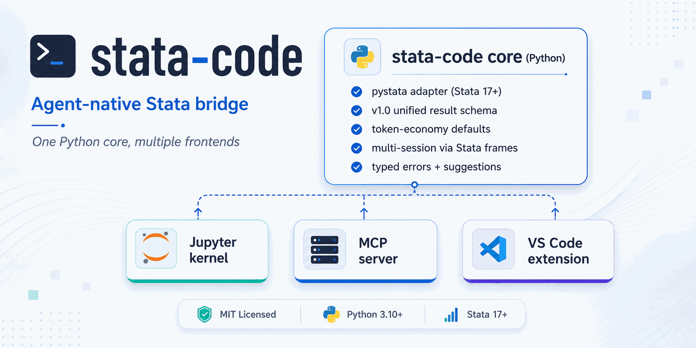

<p align="center">
  
</p>

<p align="center">
  <a href="README.md">English</a> | <a href="README.zh.md"><strong>中文</strong></a>
</p>

# stata-code

[](https://pypi.org/project/stata-code/)
[](https://pypi.org/project/stata-code/)
[](https://github.com/brycewang-stanford/stata-code/blob/main/LICENSE)
[](https://github.com/brycewang-stanford/stata-code/actions/workflows/test.yml)
[](https://pepy.tech/project/stata-code)
[](https://marketplace.visualstudio.com/items?itemName=brycewang-stanford.stata-code-vscode)
[](https://marketplace.visualstudio.com/items?itemName=brycewang-stanford.stata-code-vscode)
[](https://marketplace.visualstudio.com/items?itemName=brycewang-stanford.stata-code-vscode)
[](https://marketplace.visualstudio.com/items?itemName=brycewang-stanford.stata-code-vscode)
[](https://github.com/brycewang-stanford/stata-code/releases)
[](https://github.com/brycewang-stanford/stata-code)

<p align="center">
  
</p>

> 面向 LLM 智能体的 Stata 桥接工具 —— **一个 Python 核心，多种前端入口**。

`stata-code` 让你可以从现代开发环境中驱动 Stata：LLM 智能体（Claude Code、Cursor、Claude Desktop）、Jupyter notebook，或 VS Code 编辑器。它们共享同一个 Python 核心，并返回稳定、结构化、**适合智能体读取**的结果格式。

```text
                    ┌────────────────────────────────────────┐
                    │     stata-code core (Python)           │
                    │                                        │
                    │   • pystata adapter (Stata 17+)        │
                    │   • v1.0 统一结果 schema               │
                    │   • 默认节省 token                     │
                    │   • 通过 Stata frames 支持多 session   │
                    │   • 结构化 typed errors + 建议         │
                    └────────────────────────────────────────┘
                       ↑              ↑              ↑
              ┌────────┴────┐  ┌──────┴─────┐  ┌────┴────────────┐
              │  Jupyter    │  │  MCP       │  │  VS Code        │
              │  kernel     │  │  server    │  │  extension      │
              └─────────────┘  └────────────┘  └─────────────────┘
```

**当前状态：v0.6（2026 年 5 月）** —— core、MCP server、Jupyter kernel、VS Code 扩展都已经在 Stata 18 MP 上端到端跑通。测试套件覆盖 schema、runner、MCP、kernel、notebook、run-index、subprocess pool 和 VS Code 等模块；CI 也检查 lint、类型、schema 生成、包元数据和 VSIX 打包。许可证：**MIT**。

v0.6 明确支持的两种用户工作流：

- **在 Jupyter notebook 里跑 Stata 代码。** `pip install "stata-code[kernel]"` + `stata-code-kernel install --user` 会注册一个名为 **Stata** 的 kernel，Jupyter Notebook、JupyterLab、以及 VS Code 的 Jupyter 扩展都能在 kernel 选择器里看到它。Cell 里直接写 Stata 命令，日志、图形和警告会内联渲染（自 v0.5 起 kernel logo 已一起打包进 PyPI wheel，VS Code 的 Jupyter kernel picker 也能正常显示）。详见下文 [作为 Jupyter kernel](#作为-jupyter-kernel)。
- **可选的 agent「修复并重跑」循环。** `stata_run` 在每次失败时都会返回结构化的 `error.kind/line/context` 和 `suggestions`。默认情况下 Claude Code 只把它当作诊断信息上报；但如果你明确说「帮我修到跑通」「修复并反复运行直到成功」，agent 就会用同一组字段去改 `.do` 文件、再调 `stata_run`，直到代码通过。这个修复循环是 **opt-in** 的：默认失败 = 诊断，不是自动改写授权。详见下文 [Agent 工作流里的报错恢复](#agent-工作流里的报错恢复)。

---

## 为什么做这个项目

Stata 的 AI / agent 工具生态现在比较分散，详见 [References-tools.md](References-tools.md)：

- 现有 MCP server（[SepineTam/stata-mcp](https://github.com/sepinetam/stata-mcp)、[tmonk/mcp-stata](https://github.com/tmonk/mcp-stata)）使用 **AGPL-3.0**，不适合闭源或商业集成。
- 常用的 VS Code AI 插件（[hanlulong/stata-mcp](https://github.com/hanlulong/stata-mcp)）是 MIT，但 MCP server 被打包在插件内部，不方便单独复用。
- 每个工具都用自己的方式封装 `pystata`，返回结构不统一，智能体需要为不同工具写特殊处理。
- 很多工具一开始是为人类交互设计的，再接到 MCP 上；它们经常把 200 行日志和 base64 图片直接塞进回复，默认就大量消耗 token。

`stata-code` 要填补的就是这个空位：

1. **MIT 许可证**，没有 copyleft 传染问题。
2. 所有前端共享同一个结果格式：[SCHEMA.md](SCHEMA.md)。
3. 默认面向智能体：typed errors、结构化 `r()` / `e()`、log refs、graph refs、suggestion seeds。
4. 一个 core，多个入口：Jupyter kernel、MCP server、VS Code 扩展。

如果你关心 AGPL/GPL Stata 项目的 clean-room 边界，请看 [LICENSE-POLICY.md](LICENSE-POLICY.md)。

---

## 安装

要求：**Stata 17+**（自带 `pystata`）和 **Python 3.10+**。

```bash
# 从 PyPI 安装
pip install stata-code

# 同时安装 MCP server 和 Jupyter kernel 的额外依赖
pip install "stata-code[mcp,kernel]"

# 或者从源码安装（开发用 editable install）
git clone https://github.com/brycewang-stanford/stata-code.git
cd stata-code
pip install -e ".[mcp,kernel]"
```

> **命名说明。** PyPI 上的发行包名是 `stata-code`（带连字符），
> 但 Python 导入名是 `stata_code`（下划线 —— Python 标识符不能包含连字符）。
> 和 `scikit-learn` → `import sklearn` 是同样的约定。
> 所以：`pip install stata-code`，`from stata_code import run`。

注意：`pystata` **不在 PyPI 上**，它随 Stata 一起安装。`stata-code` 会自动在 macOS 的 `/Applications/Stata/utilities/pystata` 以及 Linux / Windows 的对应位置寻找它。如果你的 Stata 安装在其他位置，请在导入前把 `pystata` 加到 `PYTHONPATH`。

---

## 快速开始

完整 cookbook 在 [`examples/`](examples/)：基础回归、DiD、图形、多 session、大矩阵。

### 作为 Python library

包级 `run()` / `execute()` API 使用和 MCP server 相同的 subprocess-backed
runner，因此长任务会遵守 `timeout_ms`，`pystata` 对 stdout 的重定向也会被隔离在 worker 进程中，不会污染调用方进程。

```python
from stata_code import run

r = run("sysuse auto, clear")
r = run("regress mpg weight")

if r.ok:
    print(r.results.e.scalars["r2"])           # 0.6515 (native float)
    print(r.results.e.macros["cmd"])           # "regress"
    b = r.results.e.matrices["b"]
    print(dict(zip(b.cols, b.values[0])))      # {"weight": -0.006, "_cons": 39.44}
else:
    print(r.error.kind, r.error.message)       # ErrorKind.VARNAME_NOT_FOUND, "..."
    for s in r.error.suggestions:
        print("hint:", s.action)               # "Did you mean `mpg`?"
```

### 作为 MCP server

`pip install "stata-code[mcp]"` 之后，`stata-code-mcp` 会出现在你的 `PATH` 中。可以接到 Claude Code、Cursor、Claude Desktop 等任何兼容 MCP 的客户端里。

#### 用 `claude mcp add` 接入 Claude Code（推荐）

如果你还没有安装 Claude Code，请先看 [anthropics/claude-code](https://github.com/anthropics/claude-code)。

最快的方式是 `claude mcp add` 命令。根据想要的可见范围选 scope：

```bash
# user scope —— 一次安装，本机所有 Claude Code workspace 全局可用
claude mcp add stata-code --scope user -- stata-code-mcp

# local scope —— 仅当前 workspace（本地 Claude 配置，不会提交到仓库）
claude mcp add stata-code --scope local -- stata-code-mcp

# project scope —— 写入仓库内的 ./.mcp.json，和协作者共享
claude mcp add stata-code --scope project -- stata-code-mcp
```

接着运行 `claude`，输入 `/mcp` 确认 `stata-code` 出现并带有 15 个工具（`stata_run`, `stata_info`, `get_log`, `get_graph`, `get_matrix`, `list_sessions`, `cancel_session`, `reset_session`, `notebook_outline`, `notebook_get_cell`, `notebook_locate`, `notebook_edit_cell`, `notebook_insert_cell`, `notebook_delete_cell`, `list_runs`）。

#### Agent 工作流里的报错恢复

`stata_run` 不会自行改写源 `.do` 文件或替你改代码。它执行提交的 Stata 代码，所以代码本身仍可能照常生成日志、图形、表格或其他输出。Stata 报错时，`stata_run` 返回结构化诊断（`error.kind`, `error.message`, `error.line`, `error.context`）和尽力生成的 `suggestions`。这支持两种不同的 Claude Code 工作流：

- 如果你说的是「运行这个 do-file」或「验证这段代码」，Claude 可以只报告失败原因和建议的下一步，不修改源文件。
- 如果你明确说「帮我修到跑通」或「修复并反复运行直到成功」，Claude 可以基于同一组结构化错误字段修改 `.do` 文件，再调用 `stata_run` 继续迭代。

如果需要自动修复循环，请明确说出来。否则，失败的运行应先被视为诊断结果，而不是自动改写代码的授权。

#### 用 `uvx`（不必全局 pip install）

如果不想全局 `pip install stata-code`，可以用 [`uv`](https://github.com/astral-sh/uv) 临时运行：

```bash
claude mcp add stata-code --scope user -- uvx --from "stata-code[mcp]" stata-code-mcp
```

`uvx` 会在首次启动时下载并缓存 `stata-code`。注意：`pystata` **不在 PyPI 上**，仍需要在宿主机上能找到。runner 会自动把标准 Stata 安装路径（macOS 上的 `/Applications/Stata/utilities/pystata` 等）加到 `sys.path`；如果你的 Stata 在别处，请用 env 设置 `PYTHONPATH`。

#### 手动 JSON 配置（Cursor / Claude Desktop / 兜底方案）

对于没有 `mcp add` CLI 的客户端，直接编辑配置文件即可（`~/.claude/mcp.json`、Cursor settings、Claude Desktop 的 `claude_desktop_config.json` 等）：

```json
{
  "mcpServers": {
    "stata-code": {
      "command": "stata-code-mcp"
    }
  }
}
```

如果 `stata-code-mcp` 不在 `PATH` 上，也可以以 module 方式运行：

```bash
python -m stata_code.mcp
```

如果 `stata-code-mcp` 安装在项目内 virtualenv（推荐用于可复现环境），建议在
client 配置里写绝对路径，例如 `/abs/path/to/.venv/bin/stata-code-mcp`。

#### MCP 故障排查

如果 `stata_run` 返回 `adapter_crash`，并出现 `worker emitted non-JSON: '\n'`，
请升级到 `stata-code>=0.6.4`，然后重启 MCP client，让它启动新的 server 进程。
同时确认 client 解析到的是预期的 `stata-code-mcp`；项目内 virtualenv 安装
应使用 `.venv/bin/stata-code-mcp` 的绝对路径，不要依赖全局 `PATH`。

如果 OpenAI 系客户端返回 `API Error: 400 Invalid schema for function
'mcp__stata-code__notebook_insert_cell'`，并提到顶层 `oneOf`，请升级到
`stata-code>=0.6.5`，然后重启 MCP client。旧 server 进程在重启前仍会继续
暴露旧 schema。

MCP server 注册了 15 个工具：

| 工具 | 用途 |
| --- | --- |
| `stata_run` | 执行 Stata code，返回 v1.0 RunResult JSON |
| `stata_info` | 返回 Stata edition、version 和 capabilities |
| `get_log` | 通过 `log://` ref 获取完整日志 |
| `get_graph` | 通过 `graph://` ref 获取图形 bytes（`ImageContent`） |
| `get_matrix` | 通过 `matrix://` ref 获取矩阵 `{rows, cols, values}` |
| `list_sessions` | 列出 live sessions |
| `cancel_session` | 取消某个 session；subprocess-backed 路径会终止运行中的 worker，也会短路尚未开始的运行 |
| `reset_session` | 清空某个 session 的数据 |
| `notebook_outline` | `.ipynb` 的 cell 索引（cell_id、类型、源代码预览） |
| `notebook_get_cell` | 单个 cell 的完整源代码 + 节流版输出摘要 |
| `notebook_locate` | 用 snippet / regex / 报错文本定位 cell |
| `notebook_edit_cell` | 原子替换 cell 源代码（保留 id，清空 outputs） |
| `notebook_insert_cell` | 插入新 cell，分配新的 nbformat 4.5+ UUID |
| `notebook_delete_cell` | 按 id 删除 cell |
| `list_runs` | 查询 run-bundle manifest（按 notebook / cell_id / session / since / ok 过滤，用 limit / offset 翻页） |

对于新版 MCP 客户端，这些工具会返回 `structuredContent`，并在 tool
metadata 里声明 `outputSchema`；同时仍保留序列化 JSON text block，兼容旧客户端。
server 还暴露 MCP resources：

| Resource | 用途 |
| --- | --- |
| `stata://schema/run-result` | `stata_run` 结构化输出的 JSON Schema |
| `stata://server/capabilities` | server instructions、tools、resource templates |
| `stata://sessions` | 当前 subprocess-backed Stata sessions |
| `log://...` | 被截断运行结果背后的完整日志 |
| `graph://...` | 捕获到的 graph image bytes |
| `matrix://...` | 延迟获取的大矩阵 payload |

同时提供 MCP prompts：`run_do_file_and_report`、`debug_stata_error`、
`fix_and_rerun_until_passes`、`replication_audit` 和
`summarize_estimation_results`，用于常见 agent 工作流。

### 作为 Jupyter kernel

`stata-code` 的 Jupyter 支持是以 **kernel** 形式打包在 Python 包里的 —— JupyterLab 插件市场里**没有**独立的 "stata-code 插件"。安装分两步：先 `pip install` 安装带 `kernel` extra 的包，再把 kernelspec 注册到 Jupyter。

**前置条件**：本机已经安装 Stata 17+ 且持有合法许可证（kernel 通过 `pystata` 调用本地 Stata），同一个 Python 环境里已经装好 `jupyter`/`jupyterlab`，Python 版本 ≥ 3.10。

```bash
# 1. 安装带 kernel extra 的 stata-code（会同时装上 ipykernel）
pip install "stata-code[kernel]"

# 2. 把 kernelspec 注册到当前用户的 Jupyter data dir
stata-code-kernel install --user
# 等价命令：
# python -m stata_code.kernel install --user
```

检查 kernel 是否注册成功：

```bash
jupyter kernelspec list
# 输出里应该能看到名为 `stata` 的条目
```

然后打开 Jupyter Notebook / JupyterLab（或 VS Code 中的 `.ipynb`），在 kernel 选择器里挑 **Stata**，cell 里直接写 Stata 命令即可，日志、graphs 和 warnings 会以内联方式显示。

> JupyterLab 的 Extension Manager 只能安装前端 JS 扩展，**装不了 kernel**。所以上面的 `pip install` + `install --user` 是唯一支持的安装路径。

### 作为 VS Code 扩展

配套扩展已发布到 Marketplace：[`brycewang-stanford.stata-code-vscode`](https://marketplace.visualstudio.com/items?itemName=brycewang-stanford.stata-code-vscode)。它会以子进程方式启动 `stata-code-mcp`，并提供语法高亮、`**#` section 和 `program define` 的 Outline、`.do` 文件的 code-lens "Run cell" / "Run section"、侧边栏（sessions / last result / run history / logs / graphs）、状态栏指示器、补全、帮助跳转、保守变量重命名，以及来自 v1.0 typed errors 的内联诊断。

```bash
# 从 VS Code 命令行
code --install-extension brycewang-stanford.stata-code-vscode
```

或者打开 VS Code 的 **Extensions** 侧栏，搜索 `stata-code`。

扩展仍然依赖系统 Python 上安装了 MCP extra（`pip install "stata-code[mcp]"`），从而保证 `stata-code-mcp` 在 `PATH` 上可用，并且能导入 MCP SDK。和其它前端一样，需要 Stata 17+ 和有效的 Stata 许可证。

---

## 默认节省 token

典型的 `stata_run` 响应比现有 MCP server 直接返回日志和图片的方式小约 **10 倍**。核心设计有三点：

1. **日志默认只返回 `head` + `tail` + `ref`**。完整日志可以按需用 `get_log(ref)` 获取。Stata 回归日志可能有约 6,000 tokens，`stata-code` 默认约 600 tokens。
2. **图形默认返回 refs，不内联 base64**。一个 30 KB PNG 转成 base64 约 50,000 tokens；返回 ref 可以让智能体只在真正需要渲染时再取 bytes。
3. **错误是结构化 typed errors**。智能体可以判断 `err.kind == "varname_not_found"`，而不是正则解析英文日志。

例如，变量名写错时返回的是结构化错误：

```json
{
  "ok": false,
  "rc": 111,
  "error": {
    "kind": "varname_not_found",
    "varname": "mpgg",
    "line": 3,
    "context": {
      "before": ["use auto"],
      "failing": "summarize mpgg",
      "after": []
    },
    "suggestions": [
      {"action": "Did you mean `mpg`?", "command": "describe"}
    ]
  }
}
```

完整 schema 见 [SCHEMA.md](SCHEMA.md)。

---

## 架构

```text
stata_code/
├── core/
│   ├── _runtime.py    # process-singleton pystata wrapper
│   ├── _refs.py       # LRU ref store for log/graph/matrix payloads
│   ├── schema.py      # Pydantic v2 models for the v1.0 result schema
│   ├── errors.py      # rc → ErrorKind mapping + suggestion seeds
│   ├── runner.py      # in-process execute(); collects everything via sfi
│   └── _pool.py       # subprocess workers for public API / MCP hard timeouts
├── mcp/
│   └── server.py      # MCP server (15 tools)
└── kernel/
    └── kernel.py      # Jupyter kernel
```

`runner.py` 是唯一直接接触 `pystata` 的地方。包级 Python API 和 MCP server 会先走 `_pool.py`，由隔离的 worker subprocess 调用 `runner.execute()`；Jupyter kernel 为了 notebook 交互性仍使用 in-process runner。

---

## 对比

| | stata-code | SepineTam/stata-mcp | hanlulong/stata-mcp | nbstata |
| --- | --- | --- | --- | --- |
| 许可证 | **MIT** | AGPL-3.0 | MIT | GPL-3.0 |
| 独立 MCP | ✓ | ✓ | 与 VS Code 捆绑 | — |
| Jupyter kernel | ✓ | — | — | ✓ |
| 统一结果格式 | ✓ ([SCHEMA.md](SCHEMA.md)) | per-tool | per-tool | per-tool |
| 默认节省 token | ✓ (log refs, graph refs) | — | — | — |
| 结构化错误和建议 | ✓ (32 kinds) | — | — | — |
| 多 session | ✓ (Stata frames) | partial | — | — |
| 生态成熟度 | early | ✓ (statamcp.com, cookbook) | ✓ (11k installs) | ✓ |

`stata-code` 是这个问题空间里更年轻的、MIT 许可证的、agent-native 的替代方案。AGPL 方案里，SepineTam 的 `stata-mcp` 目前更成熟；`stata-code` 的目标是服务那些不能接受 copyleft 传染、又需要结构化智能体接口的场景。

---

## 路线图

### 已完成（截至 v0.6 —— 2026 年 5 月）

- v1.0 result schema ([SCHEMA.md](SCHEMA.md))
- 基于 `pystata` 的 runner，原生类型化的 `r()`、`e()` 和矩阵
- 通过 Stata frames 支持多 session（`session_id` 接受 `[A-Za-z0-9_-]+`；例如 `model-a` 这类 id 会在内部映射到合法的私有 frame 名，但返回结果仍回显公开 id）
- 行级错误归属：line number、context、commands_executed
- 图形捕获：`png` / `svg` / `pdf` + ref store，并记录来源命令归属
- 日志截断 + ref store
- 警告抽取：5 类 + 通用 notes
- 32 类错误分类法 + 标准化建议
- MCP server：15 个工具，覆盖执行、notebook 导航 / 检索 / 原子化编辑、运行索引（`list_runs`）
- Jupyter kernel：接入 v1.0 pipeline，kernel logo 已随 wheel 一起打包
- 矩阵大小上限 + 大矩阵的 `get_matrix(ref)`（>10k cells）
- 公共 Python API 和 MCP server 的 subprocess-backed 硬超时与取消：`timeout_ms`、`cancel(session_id)`、MCP `cancel_session`
- `.ipynb` 单 cell 修复闭环：`notebook_outline` / `notebook_get_cell` / `notebook_edit_cell`，并通过 `expected_source` 做乐观并发控制；`stata_run` 回显 `origin_cell_id`
- 持久化 run bundle + `list_runs`：按 cell / origin / session / since / ok 查询 `manifest.json`，并用 limit / offset 翻页
- 从 `schema.py` 自动生成 JSON Schema 工件：[`schema/run_result.schema.json`](schema/run_result.schema.json)
- VS Code 扩展已发布到 Marketplace [`brycewang-stanford.stata-code-vscode`](https://marketplace.visualstudio.com/items?itemName=brycewang-stanford.stata-code-vscode)：语法高亮、section outline/navigation、code-lens cell/section runner、侧边栏（sessions / last result / run history / logs / graphs）、状态栏、补全、保守变量重命名、诊断、MCP 子进程
- Clean-room 许可证策略 ([LICENSE-POLICY.md](LICENSE-POLICY.md))

### 下一步

- Stata 11–16 的 console fallback，按 v1.0 schema 重新实现
- 决定 Jupyter kernel 是否也迁到 subprocess pool，或者继续清楚记录当前为了交互性保留 in-process runner 的取舍
- VS Code 体验打磨：Extension Host 端到端测试、首次启动诊断、命令面板 UX
- **v1.0** —— 稳定 schema，覆盖更广的 Stata edition

明确不做的范围见 [SCHEMA.md §7](SCHEMA.md)。

---

## 测试

```bash
pip install -e ".[dev,mcp,kernel]"
pytest                              # 完整测试集；本机有 Stata 时包含真实 Stata 集成测试
pytest -m "not stata_required"      # CI 子集，不需要 Stata
pytest -m "stata_required" -v       # 仅 Stata 集成测试
```

`stata_required` marker 标记真实 Stata 集成测试。CI 使用 `pytest -m "not stata_required"`，因此不会收集这些测试。本地没有 Stata 时，这些测试也会用 `"pystata / Stata 17+ not available"` 信息 cleanly skip。

---

## 贡献

- 提 PR 前请先读 [LICENSE-POLICY.md](LICENSE-POLICY.md)。
- 第一个 PR description 里请加一行 acknowledgement，模板在 policy 文件里。
- 新增 schema field 或 runner 行为时必须补测试。

---

## 许可证

代码使用 [MIT](./LICENSE)。[LICENSE-POLICY.md](LICENSE-POLICY.md) 说明本项目如何处理和其他 Stata 项目的关系。

## 商标声明

Stata 是 StataCorp LLC 的注册商标。本项目是独立项目，不隶属于 StataCorp，也未获得 StataCorp 背书。

## 致谢

本项目参考和学习的 Stata 工具生态整理在 [References-tools.md](References-tools.md)。其中列出的项目保留各自的许可证和作者归属；复用前请查看对应仓库。
