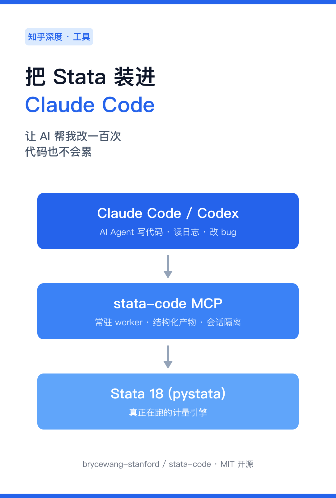
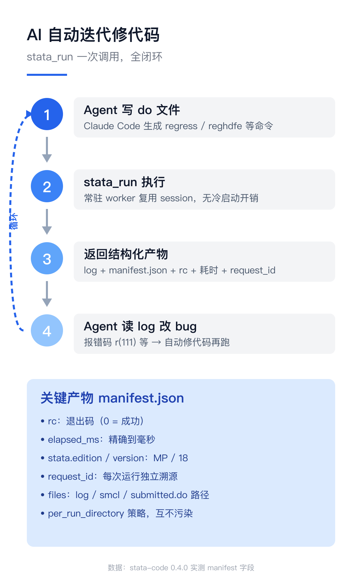
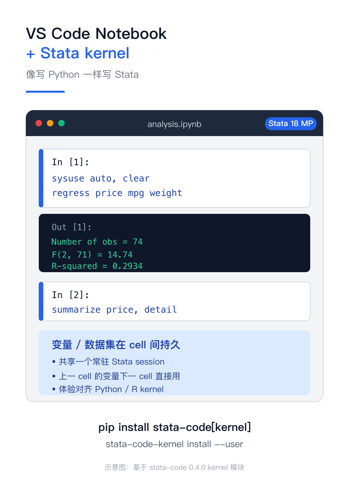
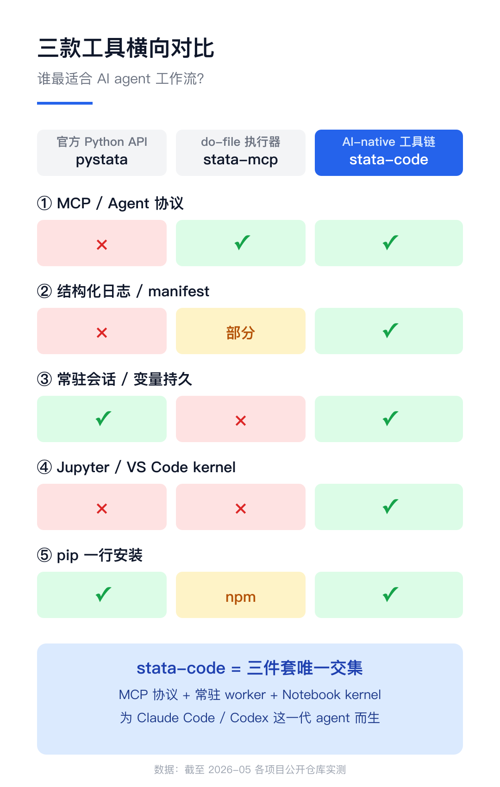
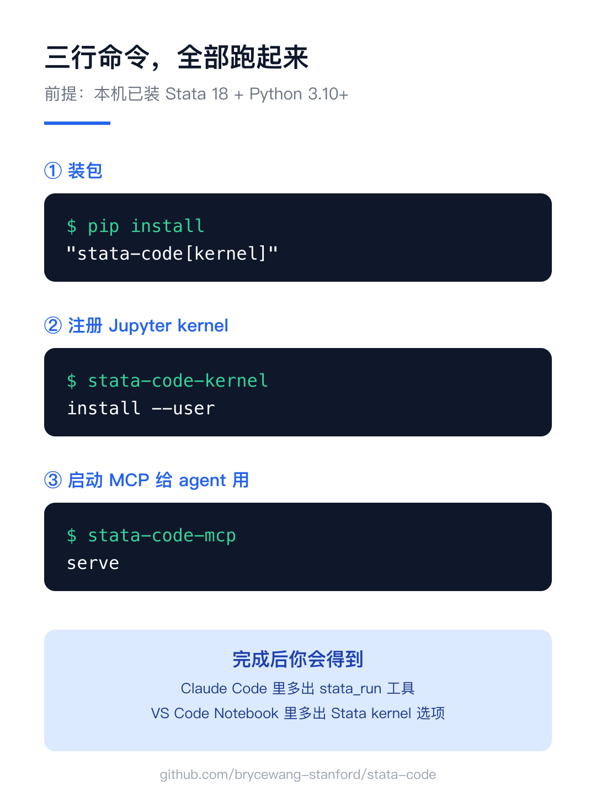

# 把 Stata 装进 Claude Code：让 AI 帮我改一百次代码也不会累

*图 1：stata-code 把 AI agent、MCP 协议、Stata 引擎串成一条流水线*

之前我用 Claude Code 写计量代码，最痛的是这一段：AI 写完一段 do 文件，我得手动复制到 Stata 端跑、再把报错粘回来——一来一回，一晚上就耗光了。直到我把 **stata-code** 装上，AI 自己跑、自己读 log、自己改 bug。这篇讲它做了什么，以及和 pystata、stata-mcp 的差距。

## 一、Claude Code 的"自驱动"循环

stata-code 的核心是一个 MCP server，把 `stata_run` 工具暴露给 Claude Code、Codex 这类 agent。AI 调用一次就拿到完整闭环：log、manifest.json、退出码、毫秒级耗时、唯一 request_id 全在结果里。

*图 2：四步闭环——写代码 → 执行 → 读结构化产物 → 自动改 bug*

报错了？AI 直接读 log 改 do 文件再跑，一次会话里循环二十次都不会乱。每次运行落一个独立目录，互不污染——溯源、复现、调试全靠这套 manifest。重要的是它**不重写你的源 .do 文件**，只跑你提交的内容，保证人写的代码不会被 AI 偷偷改掉。

## 二、Notebook + Stata kernel：像写 Python 一样写 Stata

第二个杀手锏是 **Jupyter Stata kernel**。一行 `pip install stata-code[kernel]` 注册之后，VS Code Jupyter 选择器里就出现 Stata 图标。

*图 3：每个 cell 是 Stata 命令，共享一个常驻 session*

变量和数据集在 cell 之间持久——上一格 `sysuse auto` 加载的数据，下一格直接 `summarize` 就能用。整体体验对齐 Python / R kernel，做调研、教学、复现实验，都比反复跑整段 do 文件顺手得多。

## 三、和市面上其它工具的差距

目前 Stata + Python/AI 路线主要有三家：

*图 4：三款工具横向对比*

**pystata** 是 Stata 官方 Python 库——能跑代码，但没 MCP 协议、不输出结构化 manifest、更没 Notebook kernel，给 agent 用要自己再包一层。**stata-mcp** 提供 MCP，但每次写一个 do 文件整段执行、不维持 session，迭代一多上下文就丢。

**stata-code** 是这条赛道上唯一同时满足三件套的方案：MCP 协议 + 常驻 worker + Notebook kernel——为 Claude Code、Codex 这一代 agent 工具而生。

## 四、三行命令上手

*图 5：完整安装与启动*

前提：本机已装 Stata 18 + Python 3.10+。三行跑完，Claude Code 里多出 `stata_run` 工具，VS Code Notebook 里多出 Stata kernel 选项。

GitHub: brycewang-stanford/stata-code（MIT 开源）。学术圈的 AI-native 工作流，应该长成这样。
